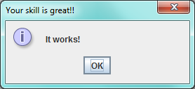

maven-executable-jar-skeleton
=============================

Skeleton project of a simple self-executable jar

## Customize the executable jar

TODO

## Launch the executable jar

Just execute this jar file: `target/maven-executable-jar-skeleton-1.0-SNAPSHOT-jar-with-dependencies.jar`.  
An information diablog box must be displayed like this screenshot:  

